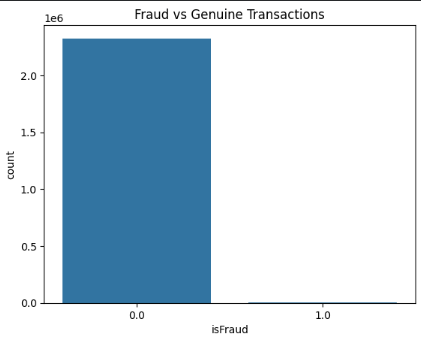
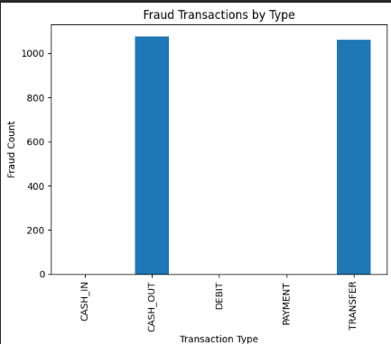
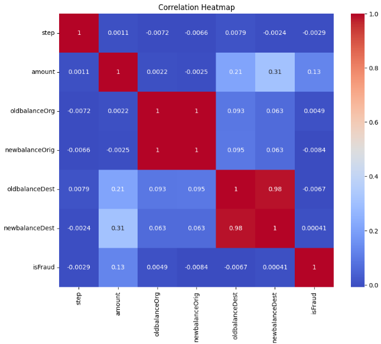

# Financial Fraud Detection System

Machine Learning based fraud detection system for detecting fraudulent financial transactions using classification algorithms and imbalance handling techniques.

## Features
- Fraud transaction prediction
- Data preprocessing and feature engineering
- SMOTE for class imbalance handling
- Multiple ML models:
  - Logistic Regression
  - Random Forest
  - XGBoost
- Model evaluation using:
  - Accuracy
  - Precision
  - Recall
  - F1-score
  - Confusion Matrix

## Technologies Used
- Python
- Pandas
- NumPy
- Scikit-learn
- XGBoost
- Imbalanced-learn
- Jupyter Notebook

## Project Structure

```bash
Financial-fraud-detection-system/

├── notebooks/
│   └── fraud_detection.ipynb

├── models/

├── data/

└── .gitignore
```

## Dataset

The dataset used in this project is too large to upload directly to GitHub.

### 📥 Download Dataset

[Click Here to Download Dataset](https://drive.google.com/file/d/165mOLMNf8XV6wsOjReZZHhWqAeVBUSx_/view?usp=sharing)

After downloading, place the dataset file inside the `data/` folder.

Expected file structure:

```bash
data/
└── fraud.csv
```
## Results Summary

| Model | Fraud Recall | Fraud Precision | F1-Score |
|---------|---------|---------|---------|
| Logistic Regression | 0.40 | 0.76 | 0.52 |
| Logistic Regression + SMOTE | 0.90 | 0.02 | 0.04 |
| Random Forest + SMOTE | 0.87 | 0.63 | 0.73 |
| XGBoost + SMOTE | 0.97 | 0.11 | 0.20 |

### Key Findings

- XGBoost + SMOTE achieved the highest fraud recall (~97%).
- Random Forest + SMOTE achieved the best balance between precision and recall (F1-score ≈ 0.73).

### Fraud vs Genuine Transactions



### Fraud Transactions by Type



### Correlation Heatmap


